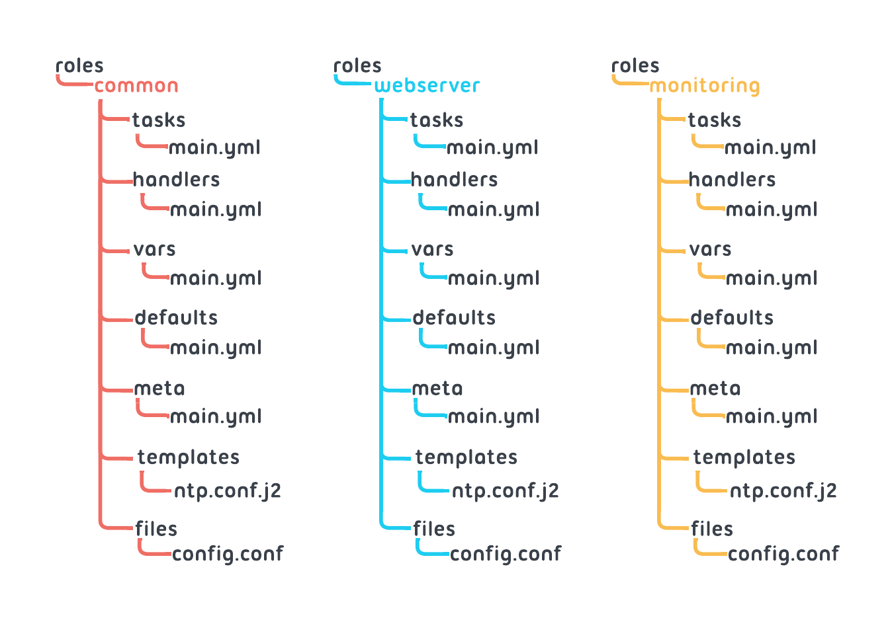

## herstellung von ssh-key-pairs
kontrol edilecek tüm serverlarda ansible isimli user olusturuldu. Hata olmasi durumunda daha rahat takib edilebilir. 

git config --global user.email "enveronderuslu@gmail.com" && git config --global user.name "Enver Onder Uslu"
 
```bash
ssh-keygen -t rsa -b 4096
ssh-copy-id -i ~/.ssh/id_rsa.pub ansible@192.168.178.115

sudo visudo # sudo for the user ansible write
ansible ALL=(ALL) NOPASSWD: ALL # Avoiding sudo password prompts in Ansible
```
If you only want to allow passwordless sudo for the reboot command:
```bash
ansible ALL=(ALL) NOPASSWD: /sbin/reboot
```

```bash
sudo echo "ansible ALL=(ALL) NOPASSWD: ALL " >> /etc/sudoers.d/ansible
sudo usermod -aG sudo ( RHEL de " wheel " yazilir) ansible
```

password ile ssh baglantisi. defaultta password ile ssh baglantisi yoktur. önce "/etc/ssh/sshd_config" icinde buun acarsin. Sonra certifikayi ayarlayip passwd yi tekrar kapatirisin. 

```bash
w3m www.muster.com # curl gibi terminalden internet sitesine gider
```
 
```bash
systemctl list-unit-files | grep enabled | nginx # enable durumdaki servisleri verir
```

ansible-galaxy collection install ansible.posix
ansible-galaxy collection  list 
ansible-doc -l # cok genel ve cok satir var
ansible-doc copy 
burada özel olarak copy modülü veriliyor detaylar ve örneklerle borlikte 
ansible-doc -t callback -l

# INTRODUCTION

ansible all --list-hosts -i inventory/main.yml
ansible all -m ping -i inventory/main.yaml

The play recap summarizes the results of all tasks in the playbook per host: in our case, for localhost.
`ok=3` indicates that each task ran successfully
In this example there are three tasks (Gathering Facts, Ping my hosts, and Print message)
`changed=0` means we did not edit any preexisting files
`unreachable` informs us if any of our tasks received an error
failed indicates if Ansible is unable to perform the task
`skipped` would tell us if a task was not executed because it didn’t need to be performed
For example, if a task installs nginx but it’s already installed on the host, Ansible will skip the task
`rescued=0` indicates that no rescue command was performed
We can add a “rescue” block of code to a task so that if the command returns false, the task will execute the second block of code rather than fail
`ignored` refers to tasks that are told to ignore_errors
Ansible will cease to execute subsequent tasks if a play fails; in this situation,
`ignore_errors = yes` will force Ansible to continue executing tasks

## SHELL de komut calistirma

```yaml

---
- name: Create file example
  hosts: localhost
  tasks:
    - name: Create/Remove a file with shell module
      ansible.builtin.shell: "touch /tmp/deneme.txt" "remove /tmp/deneme.txt"
```

## IGNORE errors
`ignore_errors`: Bir görev hata verse bile playbook’un diğer görevleri çalıştırmaya devam etmesini sağlar.

```yaml
# IGNORE FAILED COMMANDS
- name: Does not count as failure
  ansible.builtin.command: /bin/false
  ignore_errors: true
```
`ignore_unreachable`: Bir hosta bağlantı kaybolsa bile playbook’un kalan hostlar üzerinde çalışmaya devam etmesini sağlar.
```yaml
# IGNORE UNREACHABLE HOSTS
- name: This task executes, fails, ignores failure
  ansible.builtin.command: /bin/true
  ignore_unreachable: true
```
## Code Quality
Ansible Lint 
ansible-lint test.yaml  korrigieren das .yaml Dokument

## BLOCK ve  RESCUE

block ve rescue Ansible’da hata yönetimi için kullanılır.
block: İçinde bir veya birden fazla görev (task) barındıran, birlikte çalıştırılacak görev bloğudur.
rescue: Eğer block içindeki herhangi bir görev hata verirse çalıştırılan alternatif görev bloğudur.

```yaml
- hosts: localhost
  tasks:
    - block:
        - name: Hata verebilecek görev
          ansible.builtin.shell: "exit 1" 
# exit 0 basarili baska sayi olsa basarisiz demek
        - name: Bu görev sadece block başarılı olursa çalışır
          ansible.builtin.debug:
            msg: "Block başarılı"

      rescue:
        - name: Hata durumunda çalışacak görev
          ansible.builtin.debug:
            msg: "Block içinde hata oluştu"
```
exit 1 çalışırsa, rescue bloğu devreye girer ve hata mesajı yazdırılır. Eğer hata olmazsa rescue çalışmaz.

# AUTOMATION
## FILE MANAGEMENT
create a file
```yaml
- hosts: localhost
  tasks:
  - name: Create test file
    ansible.builtin.file:
      path: /path/remote_node/test_file
      state: touch # absent  yazarsan dosyayi kaldirirsin
```

create a directory
```yaml
- hosts: localhost
  tasks:
  - name: Create Test directory
    ansible.builtin.file:
      path: /home/codio/workspace/test/directory
      recurse: true
      state: directory
```
Create link
```yaml
  - name: Create Test Link
    ansible.builtin.file:
      src: /path/test
      dest: /path/test_link
      state: link
```
copy a file
```yaml
    - name: Copy index.html to the dest folder
      ansible.builtin.copy:
        src: sourse_path/index.html
        dest: /destinetion_path/index.html
```
```yaml
    - name: Copy index.html to the dest folder
      ansible.builtin.copy:
        content: "<h1> Hello, World</h1>"
        dest: /destination_path/index.html
 # uzakta dosya olusturup icine content ekledi       
```
## Replace a String  in a File
```yaml
- name: Replace a string in a file
  ansible.builtin.replace:
    path: /path/to/file.txt
    regexp: 'old_string'
    replace: 'new_string'
```

## HANDLERS
After a file has changed we sometimes need to restart/reload a service. However, if we are running multiple tasks we likely need to avoid a restart on every update made. Handlers are used to manage these situations by differentiating between services that need to be restarted, and performing the restart at the appropriate time. 'Ansible has a built-in notify mechanism to execute handlers so that they only run if notified.' 
Defined separately from tasks, handlers execute only after all tasks have been completed.
Handlers are executed sequentially, in the order they are defined in the handlers section, not in the order listed in the notify statement. Notifying the same handler multiple times will result in executing the handler only once, regardless of how many tasks notify it. For example, if multiple tasks update a configuration file and notify a handler to restart Apache, Ansible only restarts Apache once to avoid unnecessary restarts.
The Notify Keyword
The notify keyword can be applied to a task and accepts a list of handler names that are notified on a task change, as shown in the example below
```yaml
tasks:
  - name: Write the apache config file
      ansible.builtin.copy:
        src: /srv/httpd.j2
        dest: /etc/httpd.conf
      notify:
      - Restart apache

handlers:
  - name: Restart apache
    ansible.builtin.service:
      name: httpd
      state: restarted
```

The above code block is part of a playbook that includes a task to copy an Apache configuration file and a handler to restart the Apache service if the configuration file changes.
The task “Write the apache config file” uses the “copy” module to copy the source file /srv/httpd.j2 to the destination /etc/httpd.conf. The notify keyword is used to trigger the handler Restart apache when this task completes.
The handler, defined separately in the playbook, uses the service module to manage the Apache service. It specifies the name of the service as httpd and sets its state to restarted, ** which will restart the service if it is running or start it if it is not.**

# PACKAGE MANAGEMENT
## Privilege Escalation
To execute many tasks, such as creating configuration files in the /etc folder, we need root user privileges. If an ansible process is running from a normal user, the user should have sudo privilege escalation rights. In order to “become” a user with the required privileges for a task or playbook, the become keyword is used.

### The Become Directives
The directive become: true activates privileges escalation. It can be defined on the level of playbook:
```yaml
- hosts: localhost
  become: true
```
or task level:
```yaml
tasks:
  - name: Ensure the httpd service is running
    service:
      name: httpd
      state: started
    become: true
```
There are two other become directives you should be familiar with:
`become_user`   - set to the user with desired privileges. 
`become_method` - specifies a method and overrides the ansible.cfg default method

```yaml
 tasks:
  - name: Ensure the httpd service is running
    service:
      name: httpd
      state: started
    become: true
    become_user: root
```
## PLAYBOOK UNIVERSALITY

```yaml
- hosts: all
  become: true
  tasks:
    - name: ensure Ubuntu apache2 is at the latest version
        ansible.builtin.apt: 
        name: apache2
        state: present
      when: ansible_distribution == 'Ubuntu'

    - name: ensure RH apache2 is at the latest version
        ansible.builtin.yum: 
        name: apache2
        state: present    
      when: ansible_distribution == 'CentOS' or ansible_distribution == 'RedHat'            
```

## The Systemd Module

Most modern Linux distributions use systemd as their service manager. The `ansible.builtin.systemd` module is used to restart, reload, stop, and/or update systemd services.
```yaml
- name: Make sure a service unit is running
  ansible.builtin.systemd:
    state: started # stop restart reload
    name: httpd
```
state reloaded will bounce the unit.
It is recommended that restarted and reloaded be used in conjunction with handlers to avoid unnecessary restarts.

### The Daemon Reload Parameter
By default, systemd ignores changes to unit (.service) files. If a change has been made to a unit file, such as a change on the command line or changes to environment variables, the parameter daemon_reload: yes must be used to reload systemd with the updated file.
Parameter execution order is critical here, so if daemon_reload is used with a handler, pay attention to handlers’ execution order; reload should come before restart. Otherwise, systemd will pick up the old unit file.
For new files…
If a new unit file is created, reload is not needed; the file will be picked up automatically.
To specify the behavior of a service on restart of a unit, use the enabled parameter:
`enabled: true` to enable (start)
`enabled: false` to disable (stop)
Systemd can start disabled units by means of dependencies or socket activation. To stop the unit from starting it can be masked using masked: yes.

```yaml
- name: Copy the Grok Exporter systemd service file
    ansible.builtin.copy:
      content: |-
        [Unit]
        Description=Grok Exporter
        After=network.target

        [Service]
        Type=simple
        User=root
        Group=root
        Nice=-5
        ExecStart=/etc/grok_exporter/grok_exporter -config /etc/grok_exporter/grok_exporter.conf

        SyslogIdentifier="grok_exporter"
        Restart=always
        StartLimitBurst=1000

        [Install]
        WantedBy=multi-user.target
      dest: /etc/systemd/system/grok.service
      owner: root
      group: root
      mode: 0644
- name: ensure Grok started
  ansible.builtin.systemd:
    name: grok
    enabled: yes
    started: yes
    daemon_reload: yes
```
The anatomy of the Grok Exporter playbook:

The [Service] section includes:
ExecStart includes the command, in this case the Grok Exporter (the binary) that the system should start
Restart:always means if this binary crashes it will be restarted
StartLimitBurst specifies a number for which, if exceeded, it will fail
The [Install] section includes the following parameters:
dest, the destination, of the package. It’s important to note that all user managed services and system-level packages should be located in /etc/systemd/system directory.
daemon_reload: yes means we’ve created the file, so reload and update
The playbook above exemplifies that we can configure all the services.

## how to create/remove group:
```yaml
- name: Ensure group "foo" exists
  hosts: localhost
  become: true
  tasks: 
  - name: create group
    ansible.builtin.group:
      name: foo
      state: present/absent
```
## how to create user

```yaml
- name: Create user cole_train
  ansible.builtin.user:
    name: cole_train
    state: present
    system: yes # system account olarak  olusturuldu

- name: Add cole_train to cog
  ansible.builtin.user:
    name: cole_train
    groups: cog
    append: yes # varolan gruptan cikarmadan yeni gruba ekler
```
## The Password Parameter
The password parameter can be used to set user password.The hashed password (masked version) should be passed here and not the plaintext password. 
```yaml
- name: user 'cardib' with password
  ansible.builtin.user:
    name: cardib
    state: present
    password: '$6$abc$7JkzWNO0fUbALkqI26avMCt6mdHxHwxPztgnpifwpHxTq3LzQzTHAWAVJpqQblVzRSVFC7JfxlhUjgLAto9d2/'
```
## Generating SSH Keys
Ansible can generate SSH keys for users using the generate_ssh_key parameter:
```yaml
- name: create SSH keys for the user
  ansible.builtin.user:
    name: cardib
    state: present
    generate_ssh_key: true
    ssh_key_type: ecdsa
    ssh_key_file: .ssh/id_rsa    
```
## IMPORT Files
Consider the following example:
```yaml
- hosts: all
  tasks:
    - name: Import my tasks
      ansible.builtin.import_tasks:
        file: mytasks.yml
```
In this example, the file parameter is importing a specific file. 

## ROLRS


## GALAXY MODULES
For example, if you want to install and configure MongoDB for creating replica data sets, search the following command in the terminal here.
`ansible-galaxy search mongodb`Or from the Ansible Galaxy homepage, select “Database” repo and search MongoDB.
### How to install a collection
`ansible-galaxy collection install community.mongodb `
By default it will be installed into your q


folder, where it will be added to the stack. This is the default because in general it’s not good practice to include code from a third party in your repository.
Having said this, it is possible to specify different directory like ./collections to keep it with your repo using -p.
`ansible-galaxy collection install community.mongodb -p ./collections`


ansible-galaxy collection install community.mongodb -p /etc/ansible/collections/


```yaml
---
- hosts: mongodb_servers
  become: true
  collections:
    - community.mongodb
  roles:
    - mongodb_install
```
