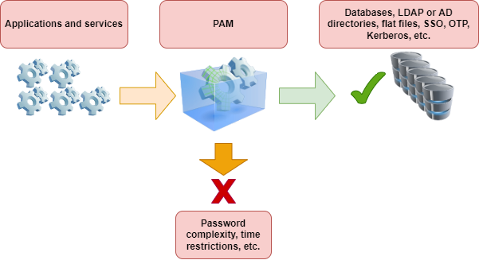
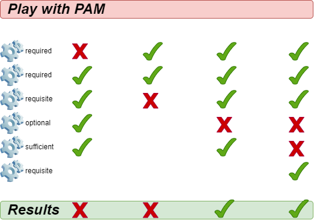

PAM Authentication Modules¶

PAM is a library suite that allows a Linux system administrator to configure methods to authenticate users. It provides a flexible and centralized way to switch authentication methods for secured applications using configuration files instead of changing application code.

Generalities¶
Authentication is the phase during which it is verified that you are the person you claim to be. 
z.B. password, but other forms of authentication exist.

Implementing a new authentication method should not require changes in source code for service configuration. This is why applications rely on PAM

Each application or service supporting PAM will have a corresponding configuration file in the /etc/pam.d/ directory. For example, the process login assigns the name /etc/pam.d/login to its configuration file.

Directives¶
A directive is used to set up an application for usage with PAM. 
Directives will follow this format:

A directive (a complete line) is composed of a mechanism (auth, account, password or session), a success check (include, optional, required, ...), the path to the module and possibly arguments 

Each PAM configuration file contains a set of directives. The order in which the modules are 
listed is very important to the authentication process.

For example, here's the config file /etc/pam.d/sudo:

#%PAM-1.0
auth       include      system-auth
account    include      system-auth
password   include      system-auth
session    include      system-auth

Mechanisms¶
AUTH - Authentication¶
This handles the authentication of the requester and establishes the rights of the account:

"auth" bölümü, kullanıcının kim olduğunu anlamak ve sisteme giriş izni verip vermemekle ilgilenir.

ACCOUNT - Account management¶
Checks if requested account is available:Relates to the availability of the account for 
reasons other than authentication (e.g. for time restrictions).

Analoji: Kapıdaki güvenlik önce: Şifreyi kontrol eder (bu authentication kısmıdır)
Sonra der ki: "Bu öğrenci bugün okula girebilir mi?" Tatilde mi? Saat çok mu geç? 
Bu sınıf artık kapandı mı?

SESSION - Session management¶
Performs tasks associated with session setup (e.g. logging)/termination.

"Session management", bilgisayara giriş cikis hazırlık ve temizlik işlerini yapan  
görevlidir. Giriş yaparken (Session Setup) görevli: Senin geldiğini bir deftere yazıyor (log), 
bazı ışıkları açıyor (kaynakları başlatıyor), Sana özel ortamı hazırlıyor (klasörleri, ayarları),
Çıkarken (Session Termination): “Tamam bu kişi gitti” diye not alıyor.
Böylece her kullanıcının giriş ve çıkışı düzgün şekilde yönetilir. 

PASSWORD - Password management¶
Changes the authentication token and possibly verifies that it is robust enough or has not already been used.
Diyelim ki bilgisayarın sana diyor ki: "şifre çok eski, yenisini yap!"
İşte burada PAM devreye giriyor. PAM, sisteme “bu şifre değiştirilecek” diyor ve bazı sifre politikalariyla ilgili  kontroller yapıyor:

*******************************************************************************

Control Indicators¶
The PAM mechanisms (auth, account, session and password) indicate success or failure. The control flags (required, requisite, sufficient, optional) tell PAM how to handle this result.

REQUIRED¶
Successful completion ist benötigt. If the module fails: The rest of the chain is executed. Finally the request is rejected.
required bir zorunlu kapıdır. Başarısız olsan bile diğer kontroller yapılmaya devam eder. 
Ama sonunda başarısız olduysan girişe izin verilmez.

REQUISTE ¶
Successful completion of all requisite modules is necessary.If the module fails: The request is immediately rejected.

SUFFICIENT¶
Modules marked sufficient can be used to let a user in "early" under certain conditions:

If the module succeeds: The authentication request is immediately allowed if none of the previous modules failed.

If the module fails: The module is ignored. The rest of the chain is executed.

Eve girmek için birkaç kapıdan geçmen gerekiyor. Ama bu kez bir kapıda yazıyor ki: “Eğer buradan geçersen, diğer kapılara gerek yok.” Eğer başaramazsan (örneğin şifre hatalıysa): “Tamam, sorun yok. Ama diğer kapılardan da geçmen gerekecek.”

Gerçek hayat örneği: Eğer bir kullanıcı LDAP’ta varsa (örneğin şirket ağı), Ya şirket ağı üzerinden tanınan bir kullanıcısındır (bu LDAP olur). Ya da bilgisayarda yerel olarak kayıtlı bir kullanıcısındır (örneğin "admin", "backup" gibi).

OPTIONAL¶
The module is executed but the result of the request is ignored. If all modules in the chain were marked optional, all requests would always be accepted.

erçek Hayat Örneği:
Diyelim sistemde şöyle bir PAM kuralı var:

bash
Kopieren
Bearbeiten
session optional pam_motd.so
Bu ne yapar?

Giriş yaptıktan sonra sana bir "Message of the Day" (günün mesajı) gösterir:

"Have a great day, $USER!" 🌞

Ama:

Bu mesaj çıkmazsa, sistem girişini engellemez.

Yani bu işlem sadece isteğe bağlıdır.

🧠 Özetle:
Durum	Etkisi
Başarıyla geçti	Sistem devam eder
Başarısız oldu	Yine sistem devam eder
Giriş etkilenir mi?	❌ Hayır

PAM modules¶
There are many modules for PAM. Here are the most common ones:

pam_unix
pam_ldap
pam_wheel
pam_cracklib
pam_console
pam_tally
pam_securetty
pam_nologin
pam_limits
pam_time
pam_access
pam_unix¶
The pam_unix module allows you to manage the global authentication policy.

In /etc/pam.d/system-auth you might add:

password sufficient pam_unix.so sha512 nullok
Arguments are possible for this module:

nullok: in the auth mechanism allows an empty login password.
sha512: in the password mechanism, defines the encryption algorithm.
debug: sends information to syslog.
remember=n: Use this to remember the last n passwords used (works in conjunction with the /etc/security/opasswd file, which is to be created by the administrator).
pam_cracklib¶
The pam_cracklib module allows you to test passwords.

In /etc/pam.d/password-auth add:

password sufficient pam_cracklib.so retry=2
This module uses the cracklib library to check the strength of a new password. It can also check that the new password is not built from the old one. It only affects the password mechanism.

By default this module checks the following aspects and rejects if this is the case:

Is the new password from the dictionary?
Is the new password a palindrome of the old one (e.g.: azerty <> ytreza)?
Has the user only changed the password case (e.g.: azerty <>AzErTy)?
Possible arguments for this module:

retry=n: imposes n requests (1` by default) for the new password.
difok=n: imposes at least n characters (10 by default), different from the old password. If half of the characters of the new password are different from the old one, the new password is validated.
minlen=n: imposes a password of n+1 characters minimum. You cannot assign a minimum lower than 6 characters (the module is compiled this way).
Other possible arguments:

dcredit=-n: imposes a password containing at least n digits,
ucredit=-n: imposes a password containing at least n capital letters,
credit=-n: imposes a password containing at least n lower case letters,
ocredit=-n: imposes a password containing at least n special characters.
pam_tally¶
The pam_tally module allows you to lock an account based on a number of unsuccessful login attempts.

The default config file for this module might look like: /etc/pam.d/system-auth:

auth required /lib/security/pam_tally.so onerr=fail no_magic_root
account required /lib/security/pam_tally.so deny=3 reset no_magic_root
The auth mechanism accepts or denies authentication and resets the counter.

The account mechanism increments the counter.

Some arguments of the pam_tally module include:

onerr=fail: increments the counter.
deny=n: once the number n of unsuccessful attempts is exceeded, the account is locked.
no_magic_root: can be used to deny access to root-level services launched by daemons.
e.g. don't use this for su.
reset: resets the counter to 0 if the authentication is validated.
lock_time=nsec: the account is locked for n seconds.
This module works together with the default file for unsuccessful attempts /var/log/faillog (which can be replaced by another file with the argument file=xxxx), and the associated command faillog.

Syntax of the faillog command:

faillog[-m n] |-u login][-r]
Options:

m: to define, in the command display, the maximum number of unsuccessful attempts,
u: to specify a user,
r: to unlock a user.
pam_time¶
The pam_time module allows you to limit the access times to services managed by PAM.

To activate it, edit /etc/pam.d/system-auth and add:

account required /lib/security/pam_time.so
The configuration is done in the /etc/security/time.conf file:

login ; * ; users ;MoTuWeThFr0800-2000
http ; * ; users ;Al0000-2400
The syntax of a directive is as follows:

services; ttys; users; times
In the following definitions, the logical list uses:

&: is the "and" logical.
|: is the "or" logical.
!: means negation, or "all except".
*: is the wildcard character.
The columns correspond to:

services: a logical list of services managed by PAM that are also to be managed by this rule
ttys: a logical list of related devices
users: logical list of users managed by the rule
times: a logical list of authorized time slots
How to manage time slots:

Days: Mo, Tu, We, Th, Fr, Sa, Su, Wk, (Monday to Friday), Wd (Saturday and Sunday), and Al (Monday to Sunday)
The hourly range: HHMM-HHMM
A repetition cancels the effect: WkMo = all days of the week (M-F), minus Monday (repeat).
Examples:

Bob, can login via a terminal every day between 07:00 and 09:00, except Wednesday:

login; tty*; bob; alth0700-0900
No login, terminal or remote, except root, every day of the week between 17:30 and 7:45 the next day:

login; tty* | pts/*; !root; !wk1730-0745
pam_nologin¶
The pam_nologin module disables all accounts except root:

In /etc/pam.d/login you'd put:

auth required pam_nologin.so
Only root can connect if the file /etc/nologin exists and is readable.

pam_wheel¶
The pam_wheel module allows you to limit the access to the su command to the members of the wheel group.

In /etc/pam.d/su you'd put:

auth required pam_wheel.so
The argument group=my_group limits the use of the su command to members of the group my_group

Note

If the group my_group is empty, then the su command is no longer available on the system, which forces the use of the sudo command.

pam_mount¶
The pam_mount module allows you to mount a volume for a user session.

In /etc/pam.d/system-auth you'd put:

auth optional pam_mount.so
password optional pam_mount.so
session optional pam_mount.so
Mount points are configured in the /etc/security/pam_mount.conf file:

<volume fstype="nfs" server="srv" path="/home/%(USER)" mountpoint="~" />
<volume user="bob" fstype="smbfs" server="filesrv" path="public" mountpoint="/public" />
W