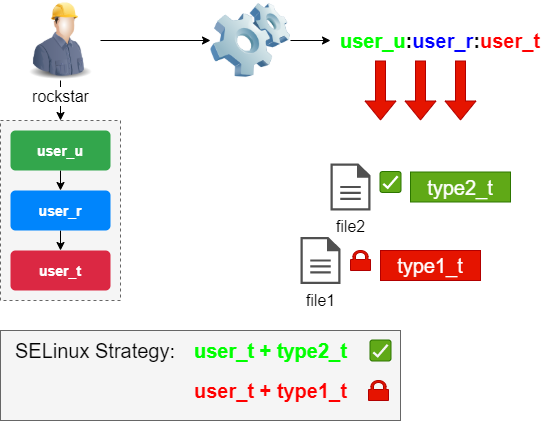

SELinux (Security Enhanced Linux )
Linux mit verbesserter Sicherheit

When a subject (z.B. an application) tries to access an object (z-B- a file), the SELinux part of the Linux kernel queries its policy database. Depending on the mode of operation (enforcing, permissive, disabled), SELinux authorizes access to the object in case of success, otherwise it records the failure in the file /var/log/messages.

Örnek: Diyelim ki Apache web sunucusu (program) /data/private/info.html adlı bir dosyaya erişmek istiyor. Bu durumda: Apache = subject (uygulama), data/private/info.html = object (dosya). Apache (subject) → dosyaya ulaşmaya çalışır (object). SELinux kontrol eder → izin varsa ✔, yoksa ✖ + log dosyasına yazar.
 
Eğer erişim reddedilirse, sistem bu olayı /var/log/messages dosyasına şöyle kaydeder:  type=AVC msg=audit(XXX): denied { read } for pid=1234 comm="httpd" name="info.html"
1. AVC – Access Vector Cache: SELinux’un, erişim izinlerini daha hızlı kontrol edebilmesi için kullandığı bir önbellektir.

Buradaki log türü type=AVC olduğunda, bu log’un bir erişim denetimi (izin verildi/verilmedi) olayıyla ilgili olduğunu gösterir. AVC logları, SELinux’un bir erişimi neden reddettiğini veya kabul ettiğini gösteren kayıt türüdür.

2. comm="httpd" – Command Name. comm, "command" yani çalışan programın adı demektir. 

Generalities¶
SELinux (Security Enhanced Linux) is a Mandatory Access Control system. Standard access management security was based on DAC (Discretionary Access Control) systems. An application operated with UID or SUID (Set Owner User Id) rights, which made it possible to evaluate permissions (on files, sockets, and other processes...) according to this user. 

A MAC system reinforces the separation of confidentiality and integrity information to achieve a containment system. The containment system is independent of the traditional rights system and there is no notion of a superuser.

SELinux uses a set of rules (policies) for this. A set of two standard rule sets (targeted and strict) is provided and each application usually provides its own rules. 
-----------------------------------------------------
The SELinux context¶
The operation of SELinux is totally different from traditional Unix rights.

The SELinux security context is defined by the trio identity+role+domain.

The identity of a user depends directly on his Linux account. An identity is assigned one or more roles, but to each role corresponds to one domain, and only one.

It is according to the domain of the security context (and thus the role) that user's rights on a resource are evaluated. 

The terms "domain" and "type" are similar. Typically "domain" refers to a process, while "type" refers to an object.

The naming convention is: user_u:role_r:type_t.

The security context is assigned to a user during their connection, according to their roles. The security context of a file is defined by the chcon (change context) command, which we will see later in this document.

Consider the following pieces of the SELinux puzzle:

The subjects
The objects
The policies
The mode
When a subject (an application for example) tries to access an object (a file for example), the SELinux part of the Linux kernel queries its policy database. Depending on the mode of operation, SELinux authorizes access to the object in case of success, otherwise it records the failure in the file /var/log/messages.

The SELinux context of standard processes¶
The rights of a process depend on its security context.

By default, the security context of the process is defined by the context of the user (identity + role + domain) who launches it.

A domain is a specific type (in the SELinux sense) linked to a process and inherited (normally) from the user who launched it. Its rights are expressed in terms of authorization or refusal on types linked to objects:

A process whose context has security domain D can access objects of type T.

