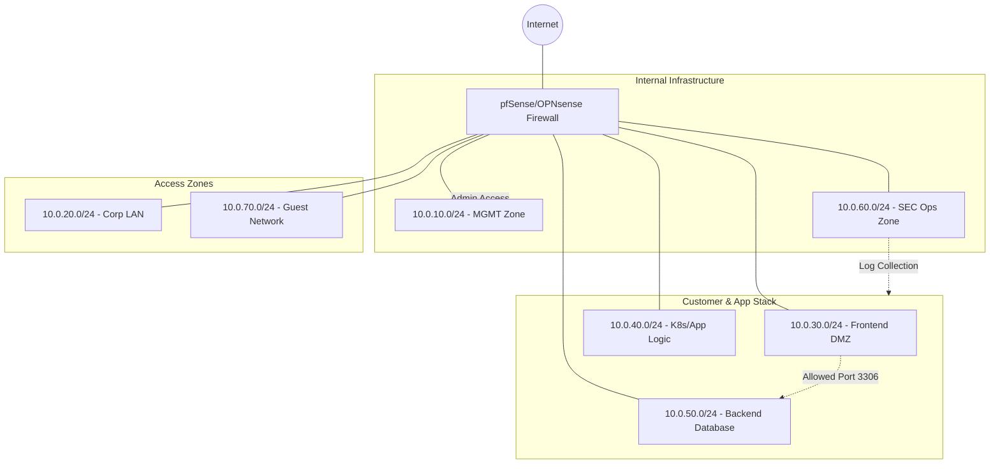

# Network Topology Diagram

## Layer 1: Network Topology

Bu dosya örnek olarak bir mermaid diagramı içerir. VS Code veya Obsidian gibi Markdown editörlerinde görüntülenebilir.

```mermaid
graph TD
Internet((Internet)) --- Firewall[pfSense/OPNsense Firewall]
subgraph Trusted_Zones [Internal Infrastructure]
Firewall --- MGMT[10.0.10.0/24 - MGMT Zone]
Firewall --- SEC[10.0.60.0/24 - SEC Ops Zone]
end


subgraph Service_Zones [Customer & App Stack]
Firewall --- DMZ[10.0.30.0/24 - Frontend DMZ]
Firewall --- APP[10.0.40.0/24 - K8s/App Logic]
Firewall --- DB[10.0.50.0/24 - Backend Database]
end


subgraph User_Zones [Access Zones]
Firewall --- LAN[10.0.20.0/24 - Corp LAN]
Firewall --- GUEST[10.0.70.0/24 - Guest Network]
end


%% Security Flow Examples
DMZ -.-> |Allowed Port 3306| DB
MGMT ==> |Admin Access| Trusted_Zones
SEC -.-> |Log Collection| Service_Zones
```